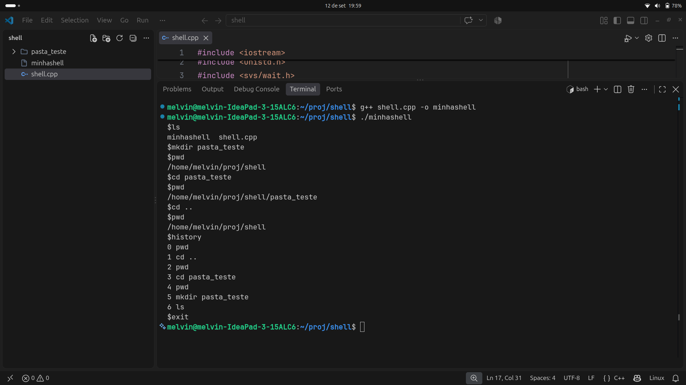

# Interpretador de Linha de Comando (Shell)

Este projeto é uma implementação em C++ de um interpretador de linha de comando (shell) simplificado, desenvolvido como atividade prática para a disciplina de Sistemas Operacionais.

##  Funcionalidades Implementadas

### 1. Comandos Internos
Os seguintes comandos são reconhecidos e executados internamente pela própria shell:
* `pwd`: Mostra na tela o diretório atual do usuário
* `cd dir`: Muda o diretório atual do usuário para o diretório especificado
* `history`: Mostra os últimos 10 comandos digitados
* `history -c`: Apaga todos os comandos do histórico
* `history [offset]`: Executa o comando correspondente ao número indicado
* `exit [n]`: Sai da shell


## Como Compilar e Executar

1. Abra o terminal no diretório onde o arquivo `shell.cpp` está localizado.
2. Compile o código-fonte executando o seguinte comando:
   ```bash
   g++ shell.cpp -o minhashell

##  Teste Realizado
